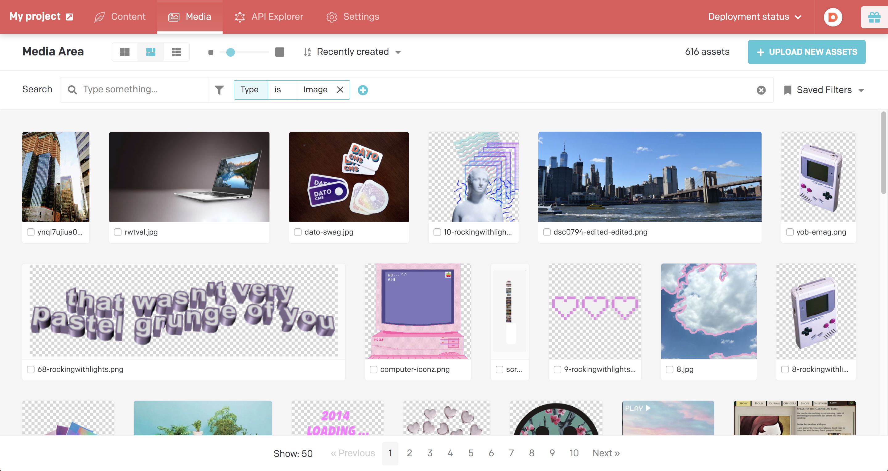
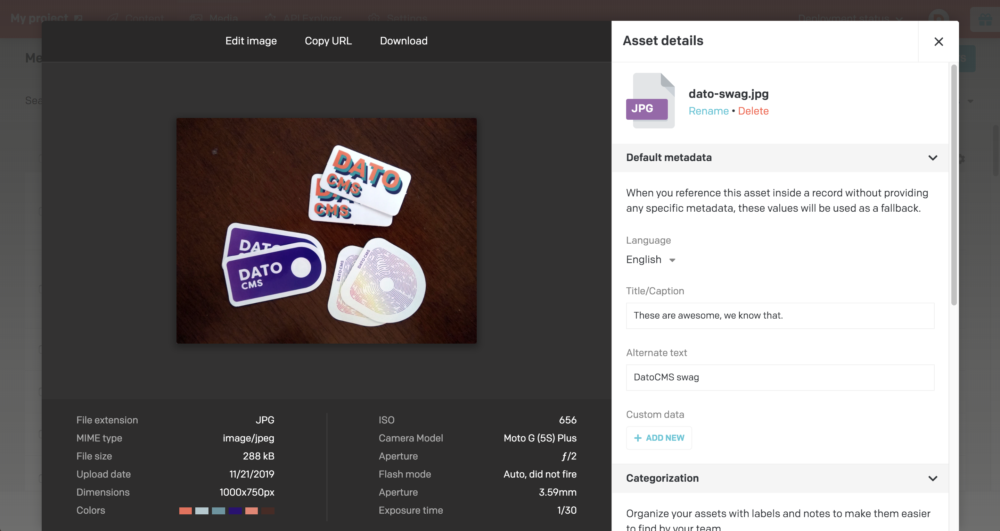
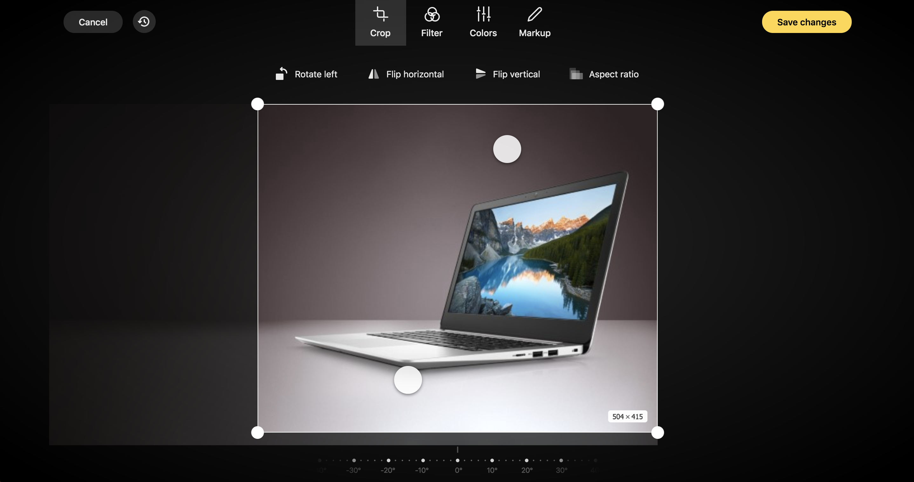

In the Media Area of your project you can upload, see, edit and organise all your assets.



Each single asset can be seen with its information and edited.



### Imgix integration

Every image/file you upload in DatoCMS is stored on [Imgix](https://www.imgix.com/), a super-fast CDN optimized for image delivery, which provides on-the-fly image manipulations and caching.

What that means is that by adding some parameters to your image URL, you can enhance, resize and crop images, compress them and change format for better performance, create complex compositions, and extract useful metadata. 

For example you can crop, resize, change quality or format and many other manipulations, while fetching the pictures.

Here's an example of an image uploaded to DatoCMS:

`https://www.datocms-assets.com/205/1570542926-example.jpg`


And if we add these parameters to the URL:

```
https://www.datocms-assets.com/205/1570542926-example.jpg?
  fit=facearea&
  faceindex=1&
  facepad=5&
  sat=-100&
  mask=ellipse&
  w=300&
  h=300&
  bg=F00&
  fm=png&
  txt=%C2%A9%20Matheus%20Ferrero&
  txt-align=bottom,center&
  txt-color=FFF&
  txt-size=15&
  txt-pad=40
```

we get this image back:


The first time the image is called with these parameters, Imgix will cache the resulting image on one of their geographically positioned CDN servers; subsequent calls with the same parameters will not need to reprocess the image. Imgix will then propagate the image to all other CDN servers around the world, as shown on the following map:


Take a look at [Imgix's Image API Reference](https://docs.imgix.com/apis/url) page to see all the transformations available.

### Asset management

For each asset you can specify a set of default metadata such as title and alternate text that can be applied as a default value when nothing else is selected.


For better asset organisation you can specify some additional categorization fields, such as notes for colleagues and author/copyright data of the asset:


If you need to add a new revision of an asset you can simply drag a new version and we'll replace the asset in every occurrence:


### Image editor

If you need to edit an uploaded image you can now edit in place with a powerful editor that allows you to crop, rotate, apply some predefined color filtering, tweak the colors and apply some basic shapes and text on the picture:



### Localisation

In case of multiple locales you are able to set default metadata on a locale basis:


And then override them in place when referincing the asset in a record:


