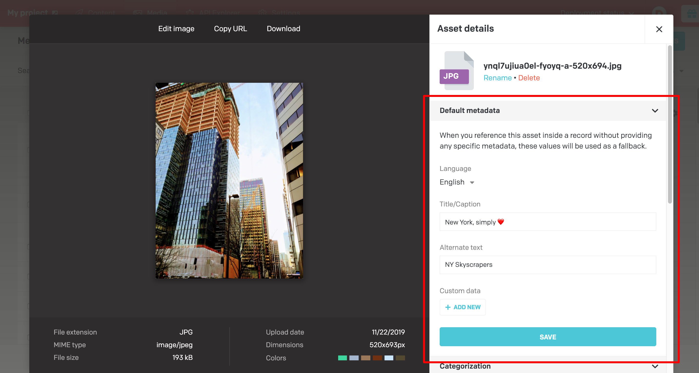
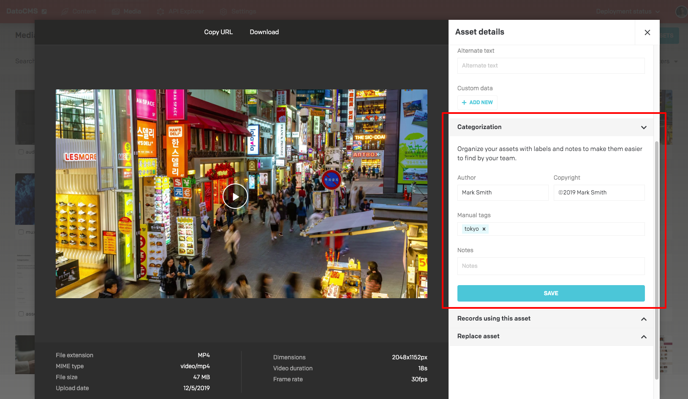
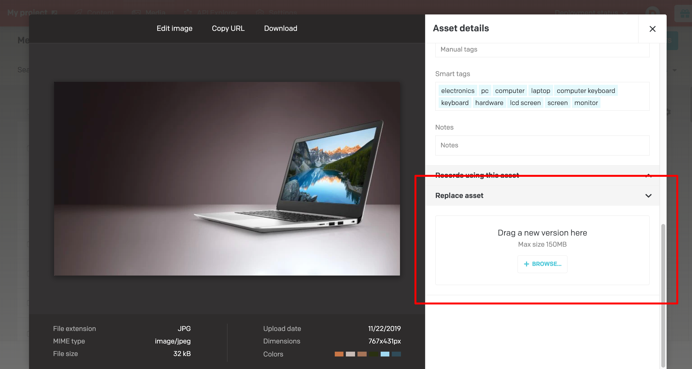
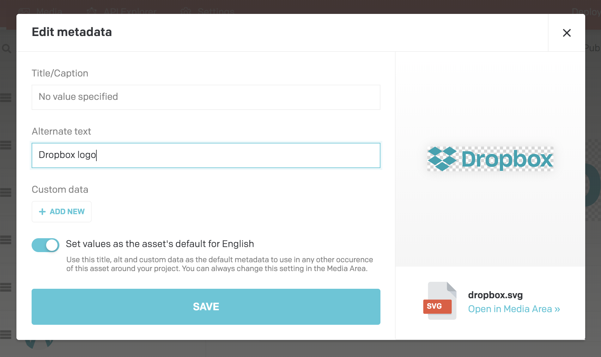

In the Media Area of your project you can upload, see, edit and organise all your assets.

Each single asset can be seen with its information and edited.

### Asset management

For each asset you can specify a set of default metadata such as title and alternate text that can be applied as a default value when nothing else is selected.

For better asset organisation you can specify some additional categorization fields, such as notes for colleagues and author/copyright data of the asset:

If you need to add a new revision of an asset you can simply drag a new version and we'll replace the asset in every occurrence:

### Image editor

If you need to edit an uploaded image you can now edit in place with a powerful editor that allows you to crop, rotate, apply some predefined color filtering, tweak the colors and apply some basic shapes and text on the picture:

### Localisation

In case of multiple locales you are able to set default metadata on a locale basis:

And then override them in place when referincing the asset in a record:

### Imgix integration

All the assets hosted on DatoCMS are automatically served via Imgix which provides on the fly image manipulations and caching.

What that means is that by adding URL parameters to the images you can do some useful editing while fetching.

For example you can crop, resize, change quality or format and many other manipulations, while fetching the pictures.

Here's an example of an image:

`https://www.datocms-assets.com/205/1482189844-ScreenShot2016-12-20at12.23.50AM.png`

And if we add these parameters to the URL:

`?border=10,000000&txt=Imgix manipulated&txt-size=62&txt-pad=30&txt-align=bottom,left&duotone=B91576,07EA00&duotone-alpha=100`

we get this image back:

