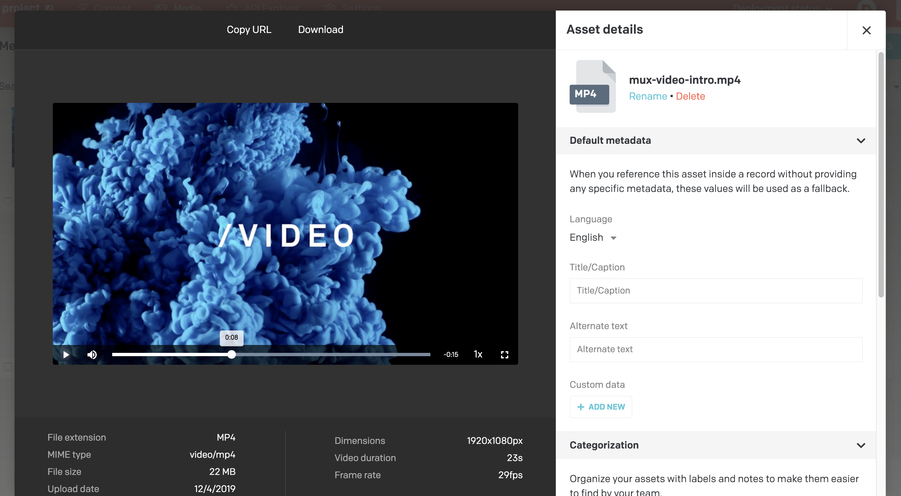

DatoCMS natively supports video encoding and streaming, thanks to the integration with [Mux](https://mux.com/), the fastest and most advanced cloud encoding platform for on-demand streaming video.

Every video you upload in your DatoCMS project will be instantly available for streaming. Videos are encoded while the first viewers watch them, giving you the fastest publishing time as possible. Encoded videos get cached on Mux's multi-CDN for future reuse as well.

DatoCMS can ingest almost every available codec including those for broadcast and professional applications (like H.264, H.265, VP9, and Apple ProRes) and thanks to HLS Adaptive Bitrate (ABR) streaming, every viewer will always download the right video size for its device and connection speed.

### Media area

You can upload videos just like you do with normal assets. From the interface you'll have access to some metadata and of course you'll be able to play the video straight away.

Then you can add a video to your models using the _asset_ or _asset gallery_ fields.

We also support integrations with embedded videos from YouTube/Vimeo/Facebook, but that's a separate field type.

### What gets exposed via the APIs

Our Content Delivery API, Content Management API and all of our API clients and integrations include:

- HSL video streaming URL;
- High, medium and low quality MP4 versions of the video to support legacy browsers that do not support HSL;
- Duration and frame rate of the video;
- Thumbnail URL: resizable, croppable and available in JPEG, PNG and GIF format;

### Pricing and availability

Integration with Mux is available starting from DatoCMS Advanced plan. Each existing plan already includes several minutes of encoding and streaming in the price, and if you ever go over-quota your website will not suffer any service interruption. At the end of the month, we’ll charge you for the difference.

### What happens if you downgrade or cancel subscription?

Videos will be kept for 60 days after the last subscription ended. After that we'll delete the video and invalidate the Mux key for streaming that video.

If you then change your mind and reactivate the project you will need to reupload the videos.

This behaviour is particular to videos as they can be very big and expensive to retain. This does not apply to other assets or data in general.