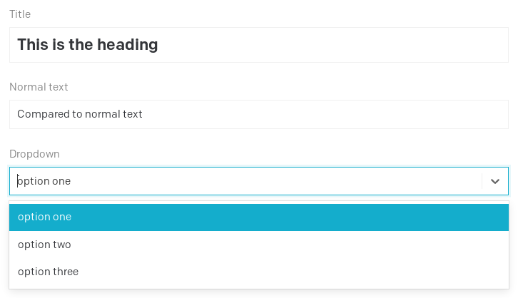
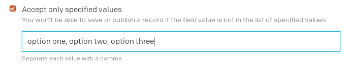
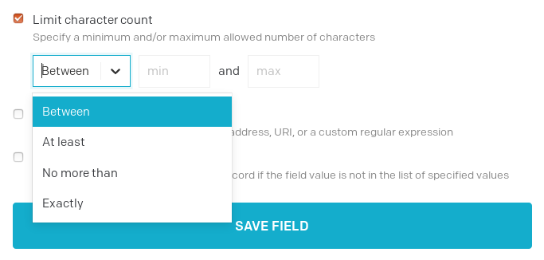
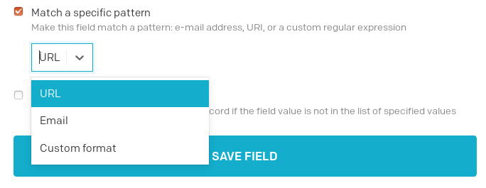
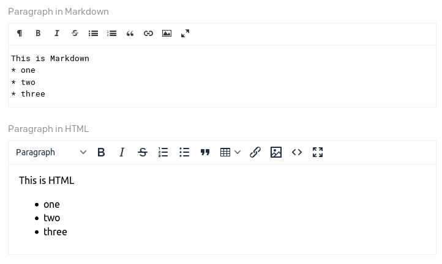
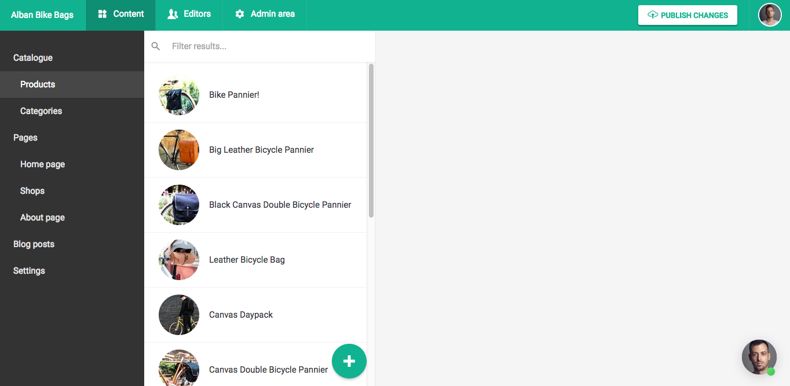

DatoCMS offers different field types, each with its own features, user interface and API capabilities.

### Generic features

All the field types are

* **required or optional**
* **localized** or not
* with a **default value**
* with a **help text**

Then every field type has its own specific features, following.

### Single-line string

Ideal for titles, headings, etc.

The single-line string has three different visualizations: heading, normal text or string with specified values.

#### Validations

By validating the single-line text to accept only specified values you are able to create a dropdown:

The other validations particular to the single-line string are the one linked to the character count:

and the pattern matching:

That accepts regular expressions as the custom format.

Finally you 

### Multiple-paragraph text

For Markdown, HTML or plain text.

By chosing the different editor you'll see that reflected in the CMS interface:

And with this field type you'll get the same validations as the single-line string, with the exception of the specified values.

### Number

Integers and floating point numbers to store SKUs, quantities, prices, etc.

### Boolean

For storing values that have two states, e.g. yes or no, true or false etc.

### Date
* **Date** and **DateTime**: A timestamp value for storing dates and times (ie. an event start, office opening hours).
* **File**: To store any kind of document (images, PDFs, ZIPs, etc.).
* **Multiple files**: To store one or more files (for sliders, carousels, etc.).
* **Video**: To reference to an external YouTube/Vimeo video.
* **Color**: For storing colors (with or without alpha channel).
* **Geolocation**: Coordinate values for storing the latitude and longitude of a physical location.
* **SEO meta tags**: To manage a page meta title, meta description, OpenGraph cards, etc.
* [**Modular content**](/docs/content-modelling/modular-content): To compose your content with text, images, videos, etc. in a Medium-like manner.
* [**Slug**](/docs/content-modelling/slug-permalinks): To generate a page permalink based on another textual field of the model.
* [**Single and multiple links**](/docs/content-modelling/links): To model relationships between content, including other models. For example, linking a blog to a category.

Each field has a name and additional metadata, like validations, or particular configurations to better present the field to the editor (hints, etc.):

Fields in DatoCMS can also be localized, if you need to accept different values based on language.

DatoCMS stores the individual pieces of content you create from a model as <strong>records</strong>, which are much like table rows in a database. You (and your editors) can create new records of a certain model within the *Content* tab of your administrative area:

