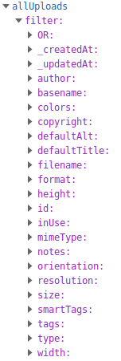

All the assets are augmented with some extra fields exposed via the
GraphQL API, to allow you some extra possibilities on the frontend.

### Images

Besides all the fields that you can explore via the CMS interface the API returns
the [blurhash](https://blurha.sh/) of every image, also as a base64-encoded image.
You can embedded that directly in the HTML of the page and then swap it with the
actual image at a later time, to offer a smooth experience when loading images (LQIP).

Alternatively a more minimal option is to use the dominant colors to prepare the space
where the image will be shown:

<iframe src="https://cda-explorer.datocms.com/?embed=&apitoken=faeb9172e232a75339242faafb9e56de8c8f13b735f7090964&query=%7B%0A%20%20allUploads%20%7B%0A%20%20%20%20colors%20%7B%20hex%20%7D%0A%20%20%20%20blurhash%0A%20%20%20%20blurUpThumb%0A%20%20%7D%0A%7D%0A></iframe>

### Videos

If you chose to upload videos on DatoCMS, thanks to the integration with [Mux](https://www.mux.com),
we can augment the video objects with:

- HSL video streaming URL;
- high, medium and low quality MP4 versions of the video to support legacy browsers that do not support HSL;
- duration and frame rate of the video;
- thumbnail URL: resizable, croppable and available in JPEG, PNG and GIF format.

Like so:

<iframe src="https://cda-explorer.datocms.com/?embed=&apitoken=faeb9172e232a75339242faafb9e56de8c8f13b735f7090964&query=%7B%0A%20%20allUploads%28%0A%20%20%20%20filter%3A%20%7B%0A%20%20%20%20%20%20type%3A%20%7Beq%3A%20image%7D%2C%20%0A%20%20%20%20%09resolution%3A%20%7Beq%3A%20large%7D%2C%0A%20%20%20%20%20%20smartTags%3A%7Bcontains%3A%22face%22%7D%0A%20%20%20%20%7D%0A%20%20%29%20%7B%0A%20%20%20%20url%0A%20%20%7D%0A%7D%0A"></iframe>

### Filtering

You can filter on all the meaningful fields that we offer in the uploads.

Here's an example of what you'll see in your CDA explorer:

