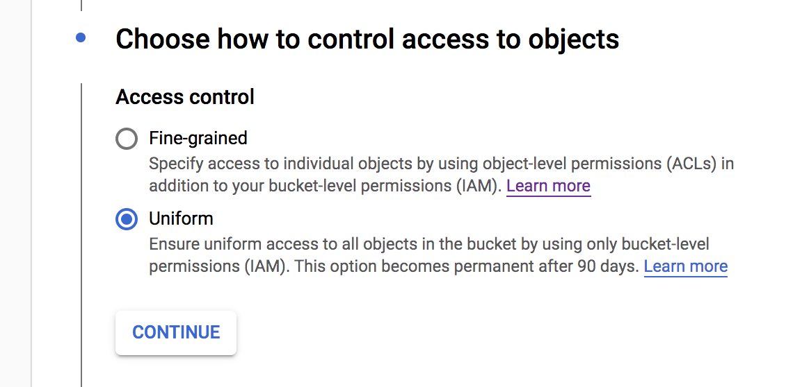
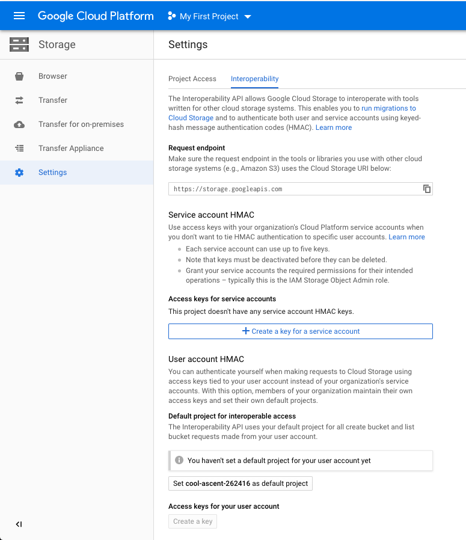
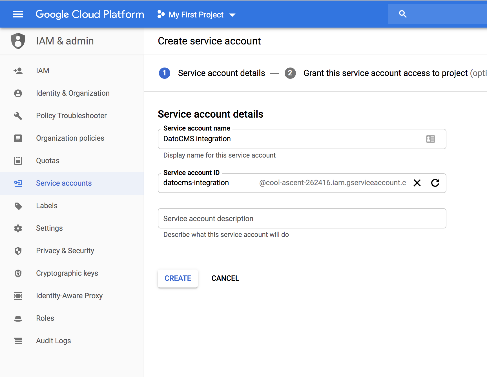
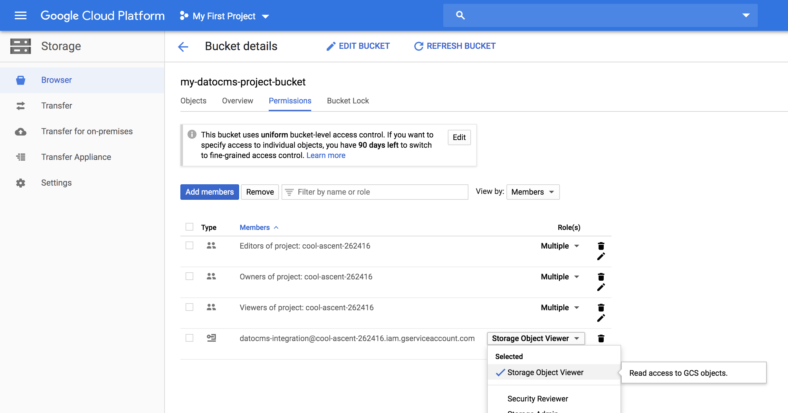
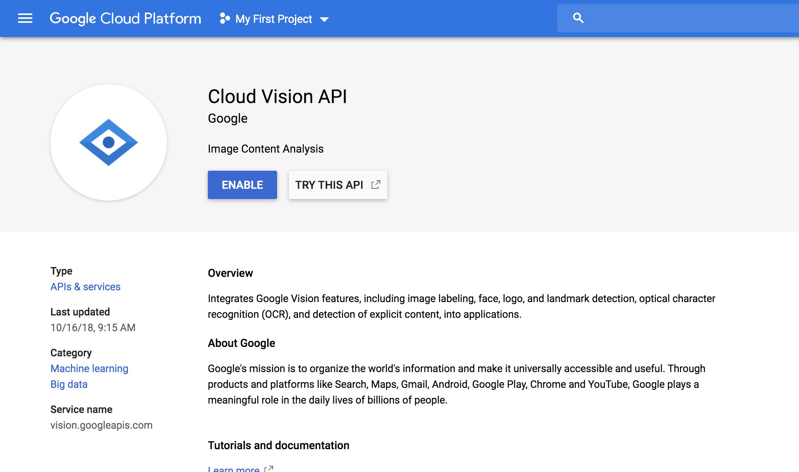
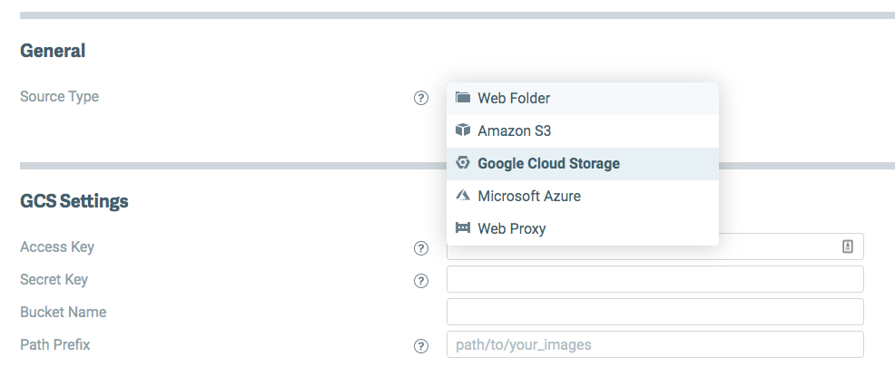

### Create a new bucket

Login to the [Google Cloud Console](https://console.cloud.google.com/storage/browser) and create a new Storage bucket inside one of your projects. Make sure you select **Uniform** access control:



#### Create an interoperable key

Open the [Cloud Storage Settings page](https://console.cloud.google.com/storage/settings) and select the **Interoperability** tab:



Inside this page:

1. Click the **Set PROJECT-ID as default project** button. If the project is already the default project, you will see *PROJECT-ID is your default project for interoperable access*.
1. Under the *User account HMAC* section, click on the **Create a key** button.

Copy **Access key** and **Secret** for later use.

#### Set up CORS policies on the bucket

The first step is to obtain a temporary access token:

1. Enter the [OAuth 2.0 playground](https://developers.google.com/oauthplayground/)
1. Under the *Select & authorize APIs* pane select `https://www.googleapis.com/auth/devstorage.full_control` (it's under *Cloud Storage JSON API v1*)
1. Click the **Authorize APIs** button and follow the authentication process
1. When the OAuth flow completes, copy the **Access token**

Perform the following API request to set up proper CORS settings to the bucket, replacing `<ACCESS-TOKEN>` with the actual access token we just obtained and `<BUCKET-NAME>` with your bucket name:

```
curl 'https://storage.googleapis.com/storage/v1/b/<BUCKET-NAME>?fields=cors' \
      -X PATCH \
      -H 'Authorization: Bearer <ACCESS-TOKEN>' \
      -H 'Content-Type: application/json' \
      --data-binary '{ "cors": [{ "maxAgeSeconds": "3600", "method": ["GET", "POST", "PUT"], "origin": ["*"], "responseHeader":["Content-Type"] }] }'
```

#### Create a Service Account key and associate it to the bucket

Enter the [Service accounts page](https://console.cloud.google.com/iam-admin/serviceaccounts) and create a new service account:



Skip the *Grant this service account access to project* step. In the last step, press the **Create key** button, and select the JSON type:


Download the JSON key file and store it for later use.

Now return to your bucket in the **Permissions** tab and add **Storage Object Viewer** role to the service account just created.



As the last step, enable the [Cloud Vision API](https://console.cloud.google.com/flows/enableapi?apiid=vision.googleapis.com) for your project:



### Create an Imgix source

Go to [Imgix](https://www.imgix.com/) and create a new account. Create a new source, and link it to the Cloud Storage bucket you just created.



#### Adding a custom domain

If you're not satisfied with the default Imgix subdomain (ie. https://your-source.imgix.net) you can add a custom domain to the Imgix source, then configure your domain DNS settings so that its CNAME record points to `your-source.imgix.net`:


#### Enable HTTPS for the Imgix source

DatoCMS requires HTTPS for custom domains. There are two different ways you can enable it. The first one is to request an HTTP certificate to Imgix. From the [Imgix documentation](https://docs.imgix.com/setup/creating-sources/advanced-settings):

> By default, you will only be able to use the custom subdomain with http. Using https requires an SSL certificate through our CDN partner and incurs additional fees—please [contact Imgix Support](mailto:support@imgix.com) to set this up.

Alternatively, to get HTTPS for free, you can use Cloudflare on top of Imgix. This is a cheaper alternative, but requires changing your original domain nameservers to the Cloudflare nameservers, which is something you might not want, and [might have some impacts in the way assets are returned](https://docs.imgix.com/best-practices/cdn-guidelines).

### Send request for custom domain assets to DatoCMS support

Once everything is ready, send an email to [support@datocms.com](mailto:support@datocms.com) and request the change. These are the information we'll ask you for:

* Your Cloud Storage bucket name (`my-bucket-name`)
* Your interoperable **Access key** and **Secret**
* Your Service account JSON key file
* The Imgix domain (ie. `your-source.imgix.net` or `assets.superduper.com`)

Together we'll schedule a maintenance window where we'll transfer every assets already uploaded to your Project to the new bucket, and enable the custom domain.

