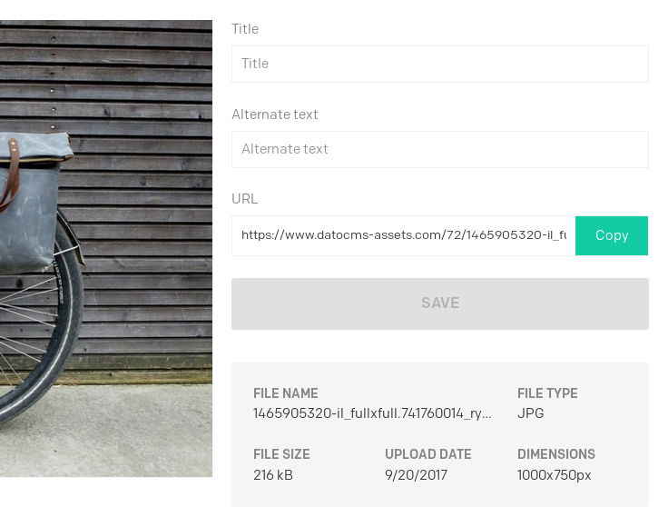
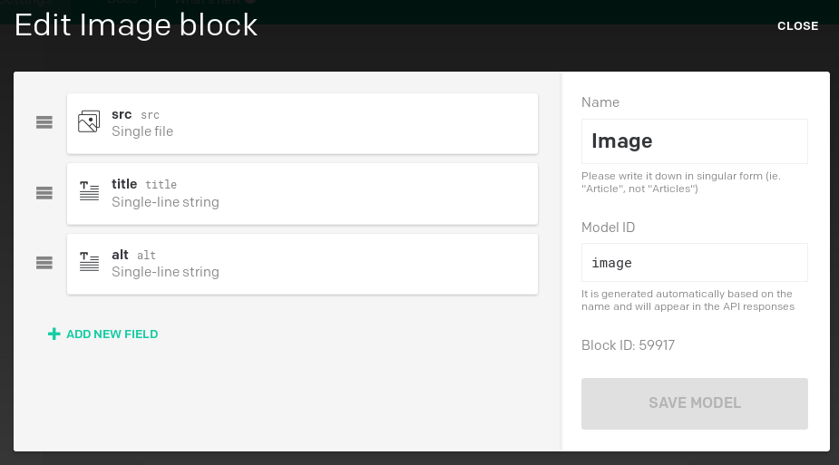
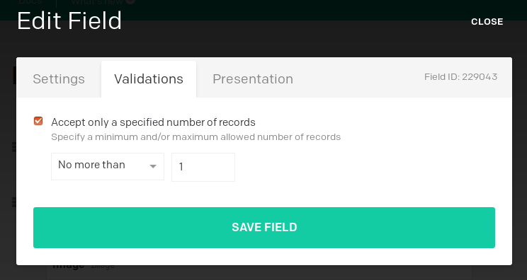
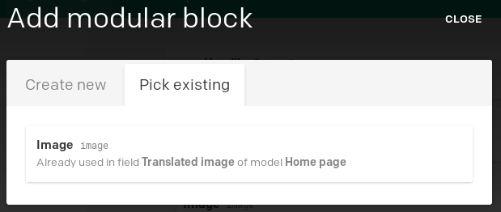

DatoCMS media handling by default gives you the title and alt field for every image:

If you don't need to localize them you can just use them straight away.

Otherwise, what we recommend is to use a *modular block* with an image field, and a couple of text fields:

You can then add the *modular block* to a localizable *modular content*. If you need a single image you can limit the number of records to one, otherwise you leave it unlimited to build a gallery:

Once you have done your first image block, you can easily reuse it across other instances, by picking an existing block:

**Pro tip**: if you chose to use the additional fields to manage image titles, you are then free to use the native title and alt text to describe your medias and leverage the search functionality in the media management section of DatoCMS. If you have a big media library this is going to be very useful to help you find the assets!

---

### Adding new locales along the way

With DatoCMS you are free to add new locales at any time; just be aware that, once a new locale is added, if some validations are present on your fields, those validations will be enforced for every locale. Records already created will therefore be marked as "invalid", and you won't be able to update your records until all the validations are satisfied for all the locales. For more information, take a look at the [Data migration](/docs/content-modelling/data-migration) chapter.

