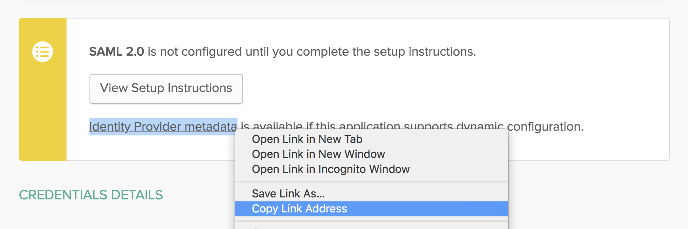

Automatic user provisioning is supported for the DatoCMS application.

This enables Okta to:

* Add new users to DatoCMS
* Update select fields in users’ profile information in DatoCMS
* Deactivate users in DatoCMS
* Push groups and membership to DatoCMS

*Disclaimer: This integration with Okta is currently under development and is not available to customers yet. [Contact us](/support) to learn more.*

### Table of Contents

### Features

The following provisioning features are supported:

* **Create User** - Creating a new user in Okta and assigning them to the DatoCMS application will create a new user in DatoCMS.
* **Update User Attributes** - Updates to a user in Okta will be pushed to DatoCMS.
* **Deactivate Users** - Deactivating the user or disabling the user's access to DatoCMS within OKTA will deactivate the user in DatoCMS.
* **Reactivate Users** - User accounts can be reactivated from Okta.
* **Import Users** - Users created in DatoCMS can be pulled into Okta and turned into new AppUser objects for matching against existing Okta users.
* **Import Groups** - Groups created in DatoCMS can be pulled into Okta for reference within Okta.
* **Push Groups** - Groups created in Okta can be pushed to DatoCMS. Attributes pushed include name and group members.
* **Delete Groups** - Groups deleted or removed from the DatoCMS application within Okta will be deleted within DatoCMS.

### Prerequisites

* Single Sign-On is only available for Ultimate and Enterprise plans.

### Configuration Steps

#### SAML App

Switch your Okta dashboard to *Admin mode* by clicking the button in the upper right corner:

Then select *Applications* and click *Add Application*:

On the new page press the **Create New App** button:

On the modal, select **SAML 2.0** and press *Create*:

A new screen will appear. Give the new app a name and press *Next*:

Fill in the following fields:

* **Single sign on URL**: Copy the *Assertion Consumer Service URL* field from DatoCMS and paste it here;
* **Audience URL (SP Entity ID)**: Copy the *DatoCMS Metadata URL* field from DatoCMS and paste it here;
* **Name ID format**: `EmailAddress`;
* **Application username**: `Email`;

TODO Leave the other fields unchanged and press *Next*:

Finish the creation of the application compiling the last wizard step and press *Finish*:

In the *Sign On* tab, copy the URL of the **Identity Provider metadata**, and paste it into the DatoCMS *Identity Provider SAML Metadata URL* field:

Make sure to also specify the default role editors will be assigned:

TODO

#### SCIM App

Switch your Okta dashboard to *Admin mode* by clicking the button in the upper right corner:

Then select *Applications* and click *Add Application*:

On the new page search for **Scim 2.0 Test App (OAuth Bearer Token)**:

A new screen will appear. Give the new app a name and press *Next*:

In the next *Sign-On Options* screen select **SAML 2.0** as the Sign-On method (no Relay state is required), set **Application username format** to **Email** and press *Done*:

Now enter the *Provisioning* tab and click the *Configure API Integration* button:

Fill in the following fields:

* **SCIM 2.0 Base URL**: Copy the *SCIM Base URL* field from DatoCMS and paste it here;
* **OAuth Bearer Token**: Copy the *SCIM API Token* field from DatoCMS and paste it here;

Click the *Test API Credentials* button and check that your credentials were verified successfully.

Now in the *Provisioning > To App* section, press the *Edit button* and:

* Enable the **Create Users** option;
* Enable the **Update User Attributes** option;
* Enable the **Deactivate Users** option;

Press the *Save* to confirm:

### Importing existing DatoCMS users in Okta

If you want to import existing users into Okta, enter the Provisioned users section in DatoCMS settings, and from there press the **Sync with regular users** button.

This will convert every DatoCMS collaborator into an SSO User:

Now under the DatoCMS app in Okta, find the **Import** tab, and click **Import Now**.

A list of DatoCMS users and possible associations with Okta users will be populated below. Click **Confirm Assignments** and these users will now be tracked, updated, and de-provisioned by Okta.

Now head over to the **Provisioning > To App** section of Okta, and under **Attribute Mappings** press the **Force Sync** button:

If the integration is working correctly, you should see the imported users with the status **Synced**:

### Provisioning Okta users to DatoCMS

There are various ways to add new users to DatoCMS within Okta. The quickest way to assign multiple users at once is to navigate to the **Assignments** tab of the Application, and press the **Assign > Assign to people button**:

From there, you will be able to assign users with the **Assign** button:

As soon as you add new users to the DatoCMS application, they will be visible in the **Provisioned users** section in DatoCMS.

### Managing provisioned user roles

#### Pushing groups

That these are the only Group attributes that are updatable via the Okta integration:

* Group name
* Group members

Groups created in DatoCMS and imported into Okta cannot be deleted or changed in Okta. They must be managed in DatoCMS.

Since groups imported from DatoCMS into Okta are not editable within Okta, it is suggested to create groups in Okta first and then push those groups to DatoCMS via the **Push Groups** button in Okta.

Create a group with the same name in Okta. For example, if a "Blog Contributor" role exists in DatoCMS, create a "Blog Contributor" group in Okta.

Add members to the group in Okta.

Open the newly created group, and press the **Manage Apps button**. In the modal, assign the group to the DatoCMS application:

Open the DatoCMS Application in Okta, open the **Push Groups** tab and click on the **Push Groups > Find groups by name** button:

Enter the first characters of the group name inside the text input, select the group from the dropdown and press **Save**:

#### Mapping Okta groups to DatoCMS roles

TODO

### Gotchas and Troubleshooting Tips

TODO

* DatoCMS application supports Just-in-Time (JIT) provisioning. The SAML assertion will create an SSO user on the fly the first time they try to log in from the identity provider.
* SAML Single Logout is currently not supported.
* Users without **First Name** or/and **Last Name** in their DatoCMS profiles will be imported to Okta as "Unknown Unknown".
* Since groups imported from DatoCMS into Okta are not editable within Okta, it is suggested to create groups in Okta first and then push those groups to DatoCMS via the **Push Groups** button in Okta.

For any other issues, please [contact our support](/support) to get customized help.
