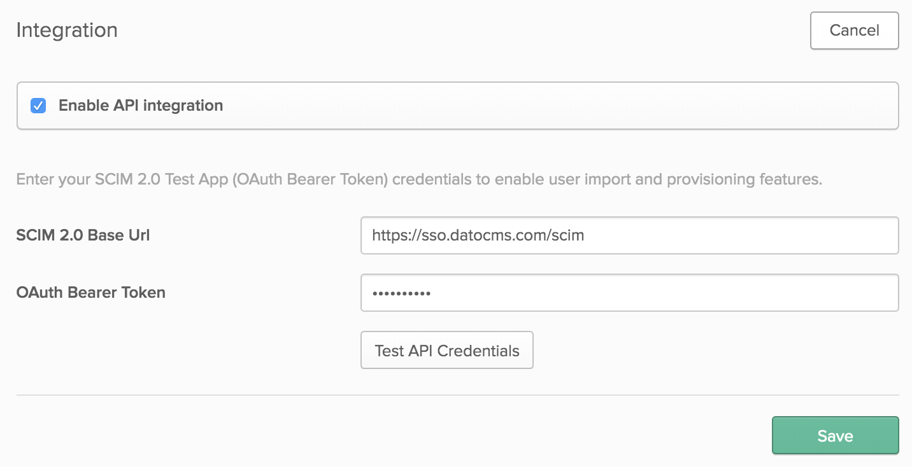

This guide provides the steps required to configure provisioning for DatoCMS, and includes the following sections:

* Features
* Prerequisites
* Configuration Steps
* Troubleshooting Tips

### Features

Automatic User Provisioning is supported for the DatoCMS application.

This enables Okta to:

* Add new users to DatoCMS
* Update select fields in users’ profile information in DatoCMS
* Deactivate users in DatoCMS
* Push groups and membership to DatoCMS

The following provisioning features are supported:

* **Push New Users** - Creating a new user in Okta and assigning them to the DatoCMS application will create a new user in DatoCMS.
* **Push Profile Updates** - Updates to a user in Okta will be pushed to DatoCMS.
* **Push User Deactivation** - Deactivating the user or disabling the user's access to DatoCMS within OKTA will deactivate the user in DatoCMS.
* **Import New Users** - Users created in DatoCMS can be pulled into Okta and turned into new AppUser objects for matching against existing Okta users.
* **Push Groups** - Groups created in Okta can be pushed to DatoCMS. Attributes pushed include name and group members.
* **Pull Groups** - Groups created in DatoCMS can be pulled into Okta for reference within Okta.
* **Delete Groups** - Groups deleted or removed from the DatoCMS application within Okta will be deleted within DatoCMS.

### SAML Configuration Steps

Switch your Okta dashboard to *Admin mode* by clicking the button in the upper right corner:

Then select *Applications* and click *Add Application*:

On the new page press the **Create New App** button:

On the modal, select **SAML 2.0** and press *Create*:

A new screen will appear. Give the new app a name and press *Next*:

Fill in the following fields:

* **Single sign on URL**: Copy the *Assertion Consumer Service URL* field from DatoCMS and paste it here;
* **Audience URL (SP Entity ID)**: Copy the *DatoCMS Metadata URL* field from DatoCMS and paste it here;
* **Name ID format**: `EmailAddress`;
* **Application username**: `Email`;

Leave the other fields unchanged and press *Next*:

Finish the creation of the application compiling the last wizard step and press *Finish*:

In the *Sign On* tab, copy the URL of the **Identity Provider metadata**, and paste it into the DatoCMS *Identity Provider SAML Metadata URL* field:

### SCIM Configuration Steps

Switch your Okta dashboard to *Admin mode* by clicking the button in the upper right corner:

Then select *Applications* and click *Add Application*:

On the new page search for **Scim 2.0 Test App (OAuth Bearer Token)**:

A new screen will appear. Give the new app a name and press *Next*:

In the next *Sign-On Options* screen select **SAML 2.0** as the Sign-On method (no Relay state is required), set **Application username format** to **Email** and press *Done*:

Now enter the *Provisioning* tab and click the *Configure API Integration* button:

Fill in the following fields:

* **SCIM 2.0 Base URL**: Copy the *SCIM Base URL* field from DatoCMS and paste it here;
* **OAuth Bearer Token**: Copy the *SCIM API Token* field from DatoCMS and paste it here;

Click the *Test API Credentials* button and check that your credentials were verified successfully.

Now in the *Provisioning > To App* section, press the *Edit button* and:

* Enable the **Create Users** option;
* Enable the **Update User Attributes** option;
* Enable the **Deactivate Users** option;

Press the *Save* to confirm:

