### Features

Automatic user provisioning is supported for the DatoCMS application.

This enables OneLogin to:

* Add new users to DatoCMS
* Update select fields in users’ profile information in DatoCMS
* Deactivate users in DatoCMS

The following provisioning features are supported:

* Push New Users
* New users created through OneLogin will also be created in DatoCMS.
* Push Profile Updates
* Updates made to the user's profile through OneLogin will be pushed to DatoCMS.
* Push User Deactivation
* Deactivating the user or disabling the user's access to the application through OneLogin will deactivate the user in DatoCMS.
* Import New Users
* New users created in the third party application will be downloaded and turned into new AppUser objects, for matching against existing OneLogin users.

### Configuration Steps

Enter from your OneLogin dashboard the *Administration section* by clicking the button in the upper right corner:


Then select *Applications* and click *Add App*:

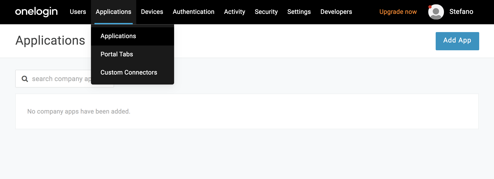

On the new page search for **SCIM v2** and select **SCIM Provisioner with SAML (SCIM v2)**:


A new screen will appear. Give the new app a name and press *Save*:

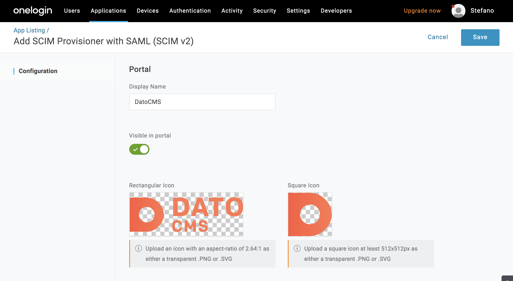

Go into the **Configuration** page and under the *API Connection* section, fill in the following fields:

* **SCIM Base URL**: Copy the *SCIM Base URL* field from DatoCMS and paste it here;
* **SCIM Bearer Token**: Copy the *SCIM API Token* field from DatoCMS and paste it here;


Fill in the **SCIM JSON Template** field with the following:

```json
{
  "schemas": ["urn:ietf:params:scim:schemas:core:2.0:User"],
  "userName": "{$user.email}",
  "externalId": "{$user.id}",
  "name": {
    "givenName": "{$user.firstname}",
    "familyName": "{$user.lastname}"
  },
  "emails": [
    {
      "value": "{$user.email}",
      "type": "work",
      "primary": true
    }
  ]
}
```

This should be the final result in OneLogin:

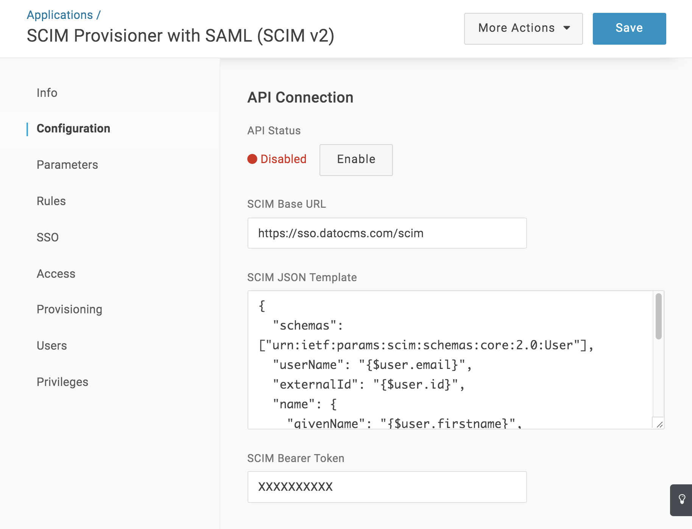

When you're done, click on the **Enable** API. If everything works correctly, you should see the API Status marked as **Enabled**:

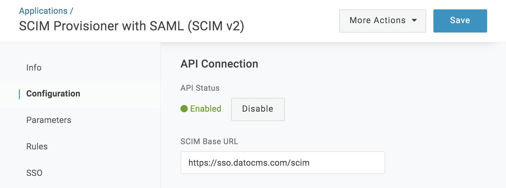

Now in the *Provisioning* section:

* Check the **Enable provisioning** option;
* Uncheck the options to require admin approval befor performing operations (**Create user**, **Delete user**, **Update user**);

You can also change the default settings to control what action must be performed in DatoCMS when users are deleted or suspended in OneLogin.

When you're done, press the *Save* button to confirm:

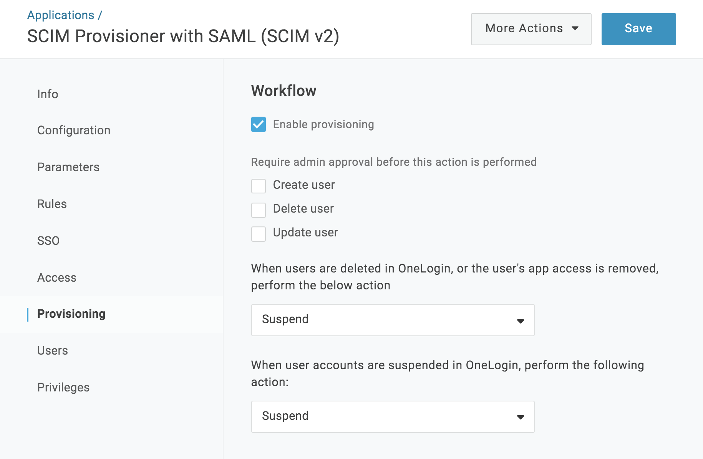

### Import DatoCMS users in OneLogin

If you want to import existing users into OneLogin, enter the **Provisioned users** section in DatoCMS settings, and from there press the **Sync with regular users** button.

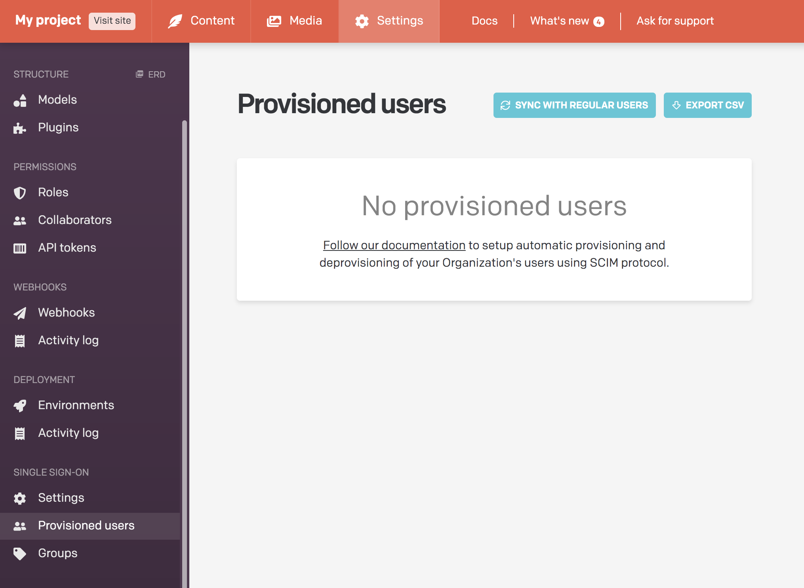

This will convert every DatoCMS collaborator into an SSO User:


You can now press the **Export CSV** button to download the CSV export file. Now go to the **Users** section in OneLogin, and press the **Import users** button:


A new panel will open up: press the **Upload File** button, and select the CSV file previously downloaded from DatoCMS. Press **Import** to start the process:

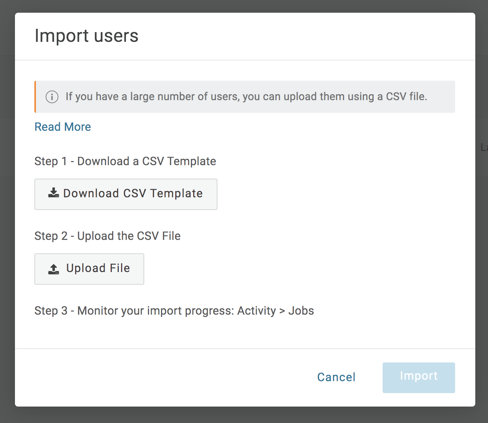

With OneLogin it's not possible to import memberships to an application, so you'll have add your existing users to the DatoCMS application manually.

### Provisioning OneLogin users to DatoCMS

OneLogin provides various ways to assign users to applications. For testing purposes we can assign a single user under **Users > [click on user name] > Applications tab**. Click the '+' sign to assign your testing user to the DatoCMS application. 

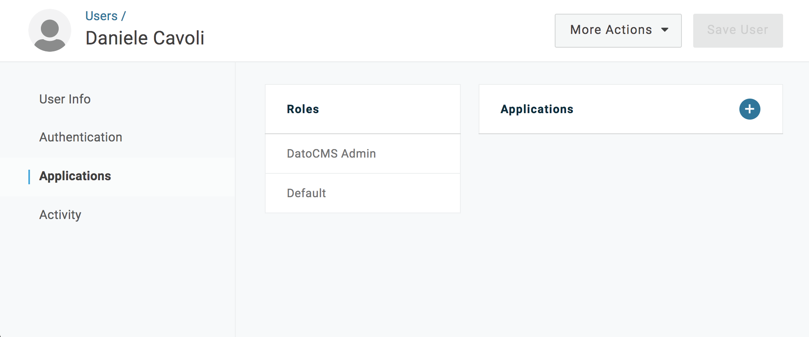

Additional information about assigning users to applications in OneLogin can be found in [Assigning Apps to Users](https://onelogin.zendesk.com/hc/en-us/articles/202123134-Assigning-Apps-to-Users).

If the integration is working, you should now see the user present in DatoCMS under the **Provisioned users** section, with the status **Synced**:


### Managing DatoCMS roles within OneLogin

Groups created within OneLogin (at https://subdomain.onelogin.com/groups) cannot be pushed to DatoCMS. Instead, in order for user membership to be managed via SCIM, groups must be created in DatoCMS and imported into OneLogin.

Enter the **Groups** section in DatoCMS settings, and from there press the **Sync with roles** button.


This will create an SSO Group for every role available in the project:


In the *Provisioning* section of your OneLogin application, press the **Refresh** button under the **Entitlements** section:

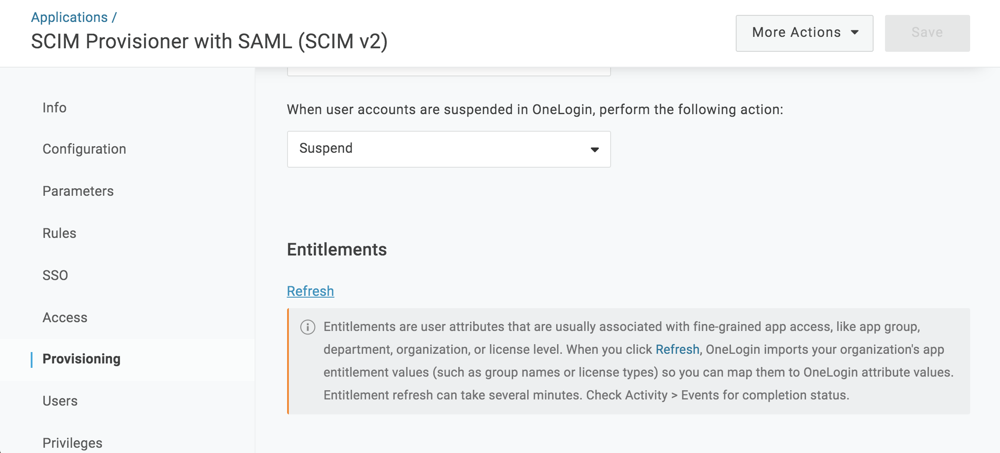

This will import DatoCMS Groups into OneLogin. Now go to the **Application > Parameters** section in OneLogin, and click on the **Groups** table row:

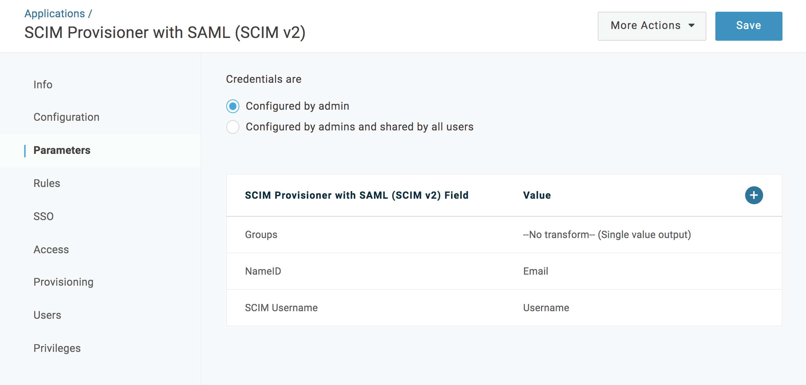

A new modal will be opened. If the integration is working, you should see under the *Value* dropdown the groups we just created in DatoCMS:


Check the **Include in User Provisioning** option and hit *Save*:

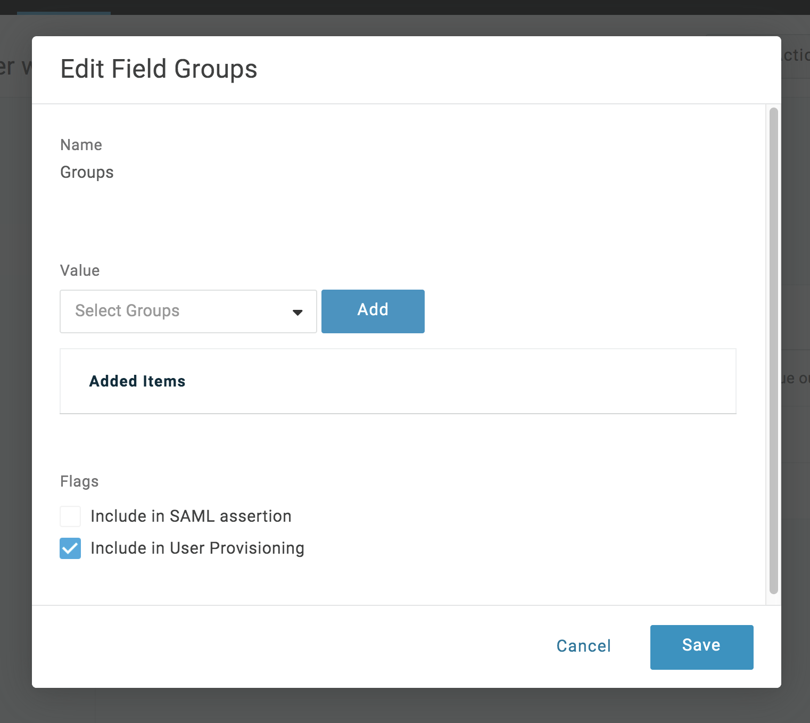

### Assigning users to groups from OneLogin

Now that the setup is complete, you can proceed assigning users to groups. OneLogin provides various ways to do that. 

For testing purposes we can assign a single user under **Applications > Users > [click on user name]**. 

From there, you should be able to add one (or more) groups to the user:

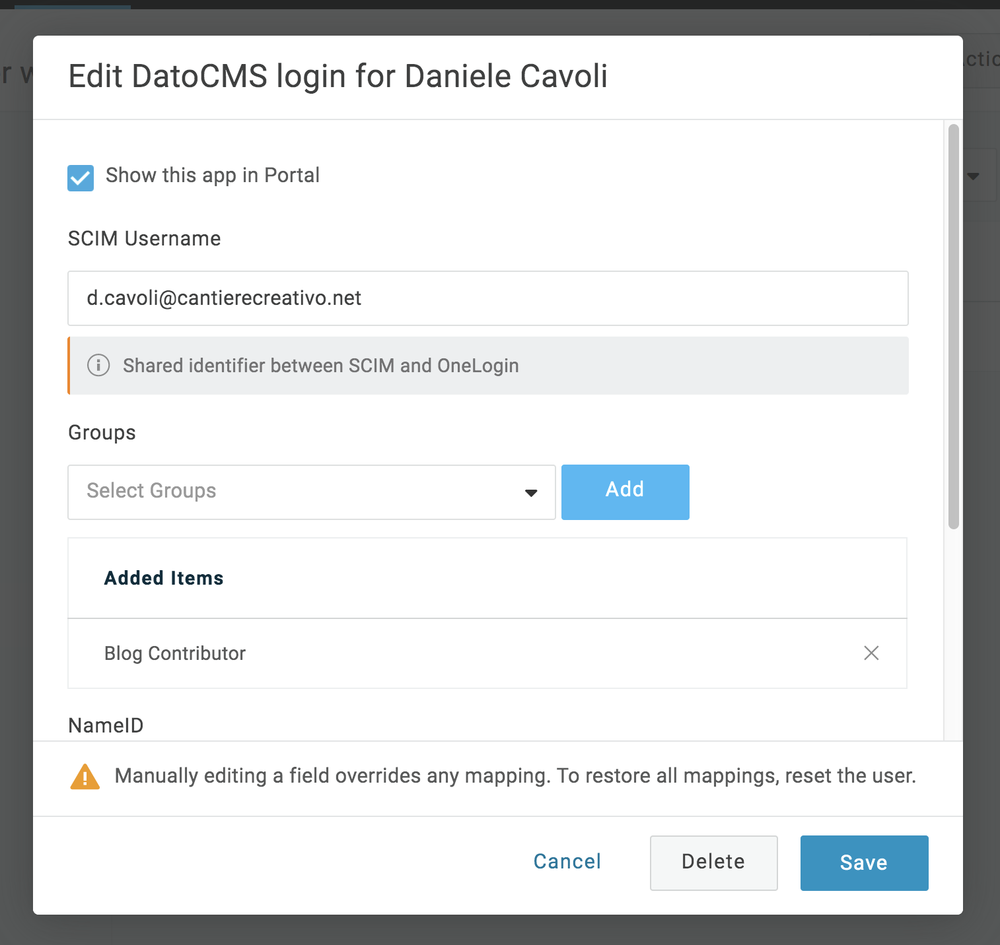

If everything worked, you should now see the correct group associated to the user in DatoCMS:

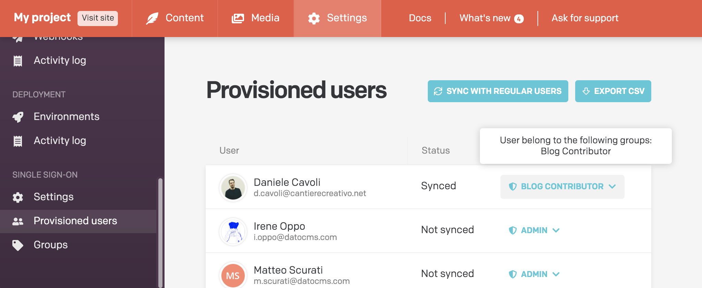

You can also use OneLogin rules (mappings) to assign users to DatoCMS groups, IAM roles, and entitlements automatically, based on another OneLogin attribute, such as OneLogin Role.

Additional information about assigning groups to users in OneLogin can be found in [Mappings](https://onelogin.zendesk.com/hc/en-us/articles/201173404-Mappings).

