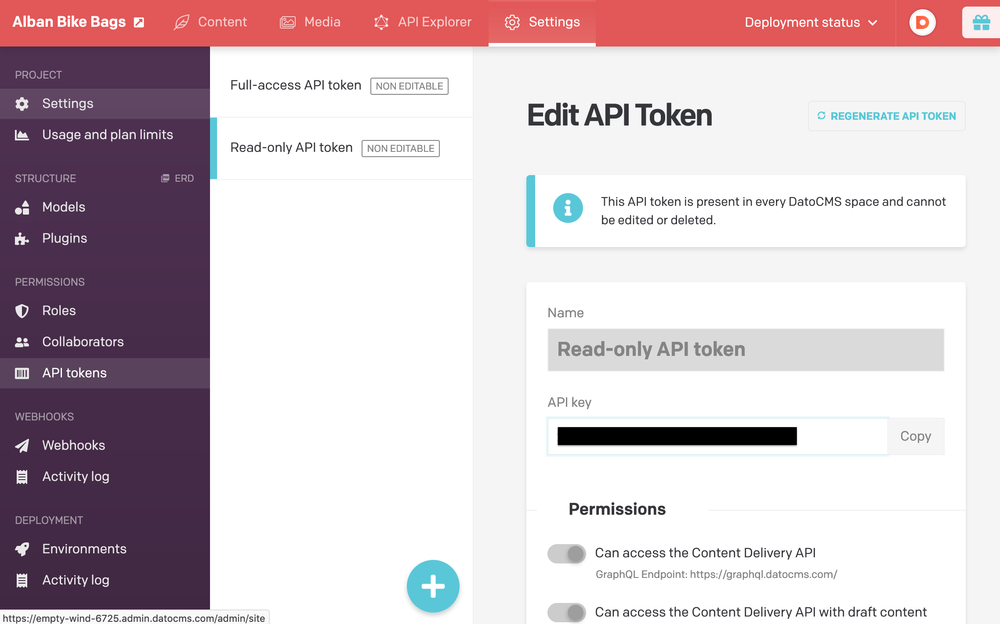
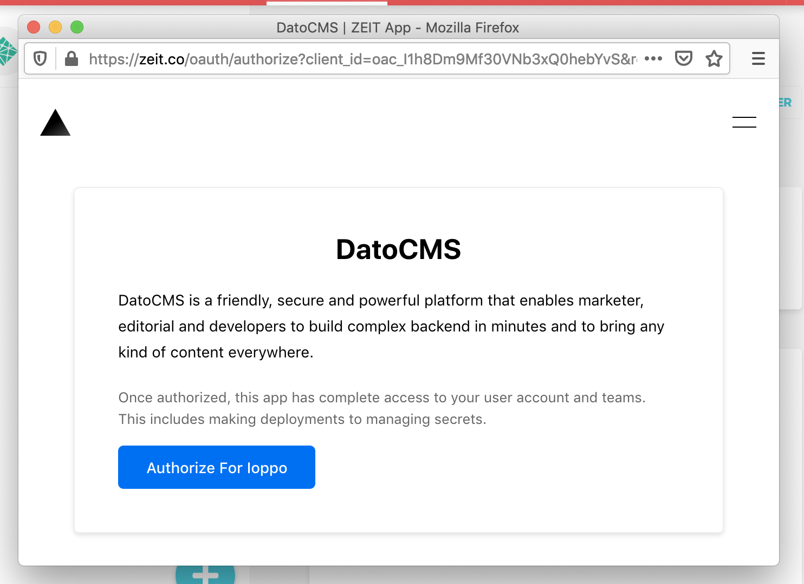
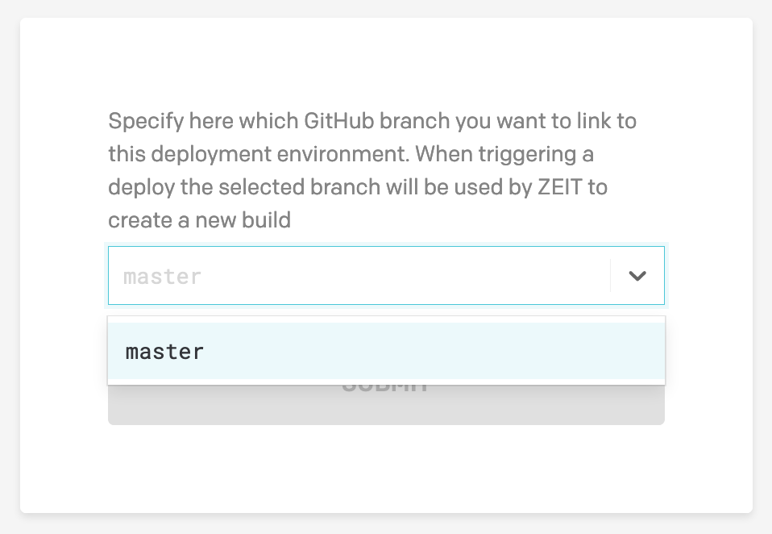

ZEIT Now is a cloud platform for static sites and Serverless Functions that enables developers to host JAMstack websites and web services that deploy instantly, scale automatically. Their free plan is perfectly compatible with DatoCMS and allows you to publish high-performant static websites.

**Warning:** this guide assumes you have a working static website project on your machine integrated with DatoCMS. If it's not the case, you can return to the [previous sections](/docs/general-concepts) of this documentation to see how to properly configure the DatoCMS administrative area and how to integrate DatoCMS with your favorite static website generator. 

### Step 1: create your Git repository

Create a new repository on [GitHub](https://github.com/new). To avoid errors, do not initialize the new repository with README, license, or gitignore files. You can add these files after your project has been pushed to GitHub.

```bash
$ git init
$ git add .
```

Commit the files that you've staged in your local repository.

```bash
$ git commit -m 'First commit'
```

At the top of your GitHub repository's Quick Setup page, click the clipboard icon to copy the remote repository URL. In Terminal, add the URL for the remote repository where your local repository will be pushed.

```bash
$ git remote add origin YOUR_GITHUB_REPOSITORY_URL
```

Now, it's time to push the changes in your local repository to GitHub.

```bash
git push -u origin master
```

Now that your project is up and running on GitHub, let's connect it to Netlify.

### Step 2: connect your repo to ZEIT

Once you have signed up to ZEIT, you can use the Git integrations with GitHub to deploy an existing project – then with a deployment for every push – by selecting a repository from your Git account.

<video class="Docs__video"
  poster="https://www.datocms-assets.com/205/1583310770-link-zeit-to-github.mp4?fm=jpg&fit=max&w=900"
  src="https://www.datocms-assets.com/205/1583310770-link-zeit-to-github.mp4?fm=mp4&w=900"
  controls="">
</video>

Now you can link one of your Github repositories to ZEIT, it will automatically create a new project for you and start a deployment right away.

Depending on your static generator the **Build command** and **Output directory** field need to be filled with different values. ZEIT can usually deduce the framework you are using and pre-compile these fields for you.

| SSG        | Build command                                       | Publish directory |
| ---------- | --------------------------------------------------- | ----------------- |
| Jekyll     | `bundle exec dato dump && bundle exec jekyll build` | `public/`         |
| Hugo       | `dato dump && hugo`                                 | `public/`         |
| Middleman  | `bundle exec middleman build`                       | `build/`          |
| Metalsmith | `dato dump && node index.js`                        | `build/`          |
| Hexo       | `dato dump && hexo generate`                        | `public/`         |
| Gatsby     | `gatsby build`                                      | `public/`         |

<video class="Docs__video"
  poster="https://www.datocms-assets.com/205/1583310865-zeit-import-github-repo.mp4?fm=jpg&fit=max&w=900"
  src="https://www.datocms-assets.com/205/1583310865-zeit-import-github-repo.mp4?fm=mp4&w=900"
  controls="">
</video>

Next step is to add your DatoCMS read-only token that will allow you to fetch your data from DatoCMS. At the moment there is no way to do that throught the ZEIT interface, so you will have to install the [Now CLI](https://zeit.co/download).

Adding environment variables requires two steps, defining the environment variable, using Now Secrets, then making it available to your projects' build step.

To create a new secret choose as a unique name -we suggest using your DatoCMS project ID- and copy the DatoCMS read-only token. You can find your API token in the _Settings > API tokens_ section:



Then use these values to launch this command:

```bash
$ now secrets add <secret-name> <secret-value>
```

The second step is to provide your project with environment variables during the Build Step, to do that you should create a `now.json` file in which you define your `DATO_API_TOKEN` variable and assign the secret you just created:

```json
{
  "build": {
    "env": {
      "DATO_API_TOKEN": "@secret-name"
    }
  }
}
```

ZEIT has different rules for using environment variables in development. Read the details in the [docs](https://zeit.co/docs/v2/build-step?query=enviro#using-environment-variables-and-secrets)

### Step 3: connect ZEIT to DatoCMS

There's only one last step needed: connecting DatoCMS to ZEIT, so that everytime your editors press the _Publish changes_ button in your administrative area, a new build process (thus a new publication of the final website) gets triggered.

<video class="Docs__video"
  poster="https://www.datocms-assets.com/205/1583314881-create-zeit-deployment-environment.mp4?fm=jpg&fit=max&w=900"
  src="https://www.datocms-assets.com/205/1583314881-create-zeit-deployment-environment.mp4?fm=mp4&w=900"
  controls="">
</video>

Let's go through the process step-by-step. First, go to the _Settings > Environments_, click on the plus icon and select _ZEIT_ as build method. The ZEIT authorization window should pop up:



On the new window that pops up, click on "Authorize" to allow DatoCMS to setup the auto-deploy meachanism and select the ZEIT project that you want to link to DatoCMS, so that a number of bi-directional hooks will be configured. You can specify which branch of your Git repository you want to link with the deployment environment that you are creating.



When everything is done, confirm the integration pressing the **Save Settings** button.
