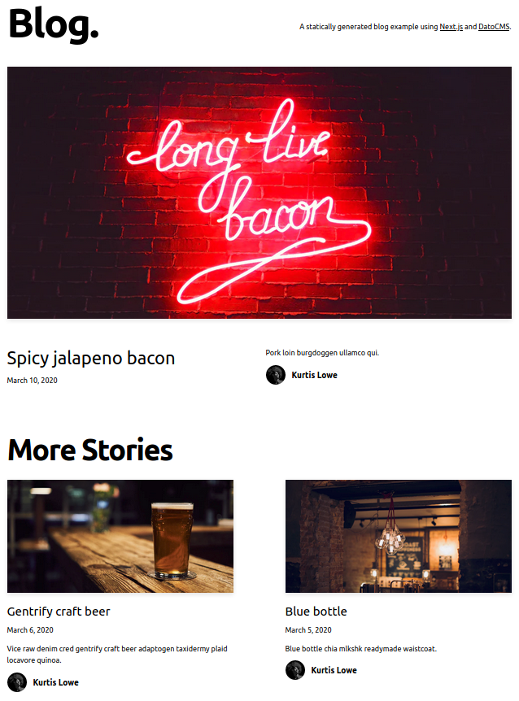

We have on example to get you started with Next.js, ZEIT Now and DatoCMS, have a look!

### Blog

Have a look at our blog example, built with Next.js!

Check the [code on Github](https://github.com/datocms/nextjs-demo) and then you can set up the demo by clicking on the following button:

