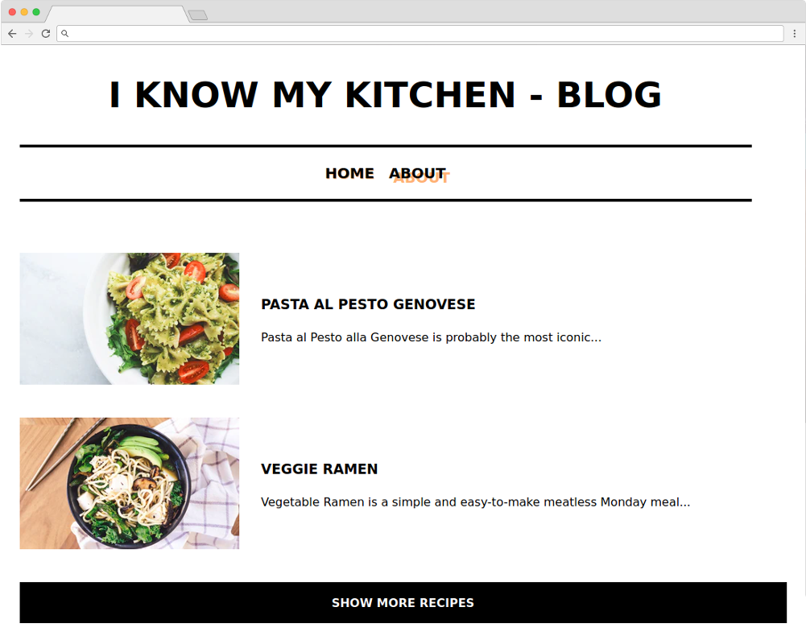

Building a single-page application using React and GraphQL is probably one of the fastest way to go live with a CMS-backed website.

With the globally-distributed CDN serving the Content Delivery API of DatoCMS **you can serve directly content to your end users without an intermediate server**. You just maintain and host a static frontend application and we deal with the rest!

To fetch GraphQL content with React from DatoCMS there are many options. We have explored a few and prepared demos for you so that you can pick your preferred flavour or start building a new one using our examples.

With the following demos we'll set up a simplistic recipe's blog:

You can [see it live here](https://datocms-react-graphql-demo.netlify.com/). The UI is exactly the same for all the projects linked here. The only difference is in how the data is fetched from the GraphQL API.

### react-datocms

All the following examples are using [our React components](https://github.com/datocms/react-datocms) to manage responsive images. With this component we can take full advantage of our optimized GraphQL API, that is returning all the information you need **to provide an exceptional support to progressive, responsive images**.

A deep and detailed writeup of what we offer in [this blog post](https://www.datocms.com/blog/offer-responsive-progressive-lqip-images-in-2020).

### React & GraphQL Request example

[GraphQL Request](https://github.com/prisma-labs/graphql-request) is a minimal GraphQL client that we've used to build probably the simplest [example project](https://github.com/datocms/react-graphql-demo) of this set. 

Set up the demo by clicking on the following button:

### React & Apollo example

If you use [Apollo](https://www.apollographql.com) to manage your data layer you can check this demo out. There's a section in the example's README that is specific to this technology that you might want to read. Here's the [project code](https://github.com/datocms/react-apollo-demo).

Set up the demo by clicking on the following button:

### React & URQL example

Finally, we used [URQL](https://github.com/FormidableLabs/urql) to build the same example using this approach. [Find the repo here](https://github.com/datocms/react-urql-demo).

Set up the demo by clicking on the following button:

