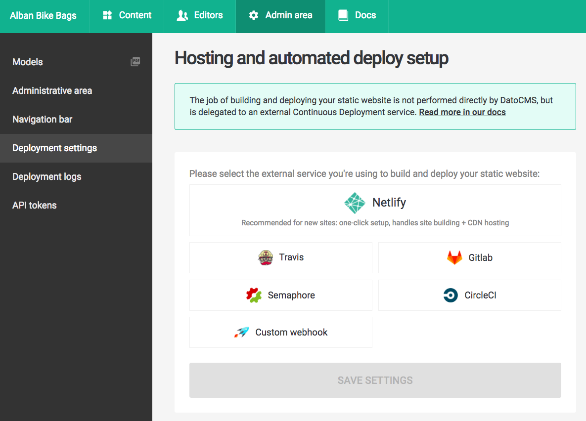

**This guide assumes you have a working static website project on your machine integrated with DatoCMS**

If that's not your case, you can return to the previous sections of this documentation to see how to properly configure the DatoCMS administrative area and how to integrate DatoCMS with your favorite static website generator. 

### Create your Git repository

DatoCMS supports both Gitlab.com and self-hosted instances of Gitlab CE. The first thing to do is to initialize a new Git repository on your website local directory:

```bash
$ git init
$ git add .
```

Commit the files that you've staged in your local repository.

```bash
$ git commit -m 'First commit'
```

Now create a new repository on [Gitlab](https://gitlab.com/projects/new). Once done, copy the remote repository URL. In Terminal, add the URL for the remote repository where your local repository will be pushed.

```bash
$ git remote add origin YOUR_GITLAB_REPOSITORY_URL
```

Now, it's time to push the changes in your local repository to Gitlab.

```bash
git push -u origin master
```

Now that your project is up and running on Gitlab, let's configure a Gitlab Pipeline that will publish your website on S3 after each further Git push.

### Enable Gitlab Pipeline

GitLab offers a continuous integration service out of the box. If you add a `.gitlab-ci.yml` file to the root directory of your repository, then each commit or push triggers your CI pipeline.

### Add the DatoCMS API token as environment variable

Reach the *Settings > CI/CD Pipelines* settings page of your project, and in the *Secret Variables* section, add an environment variable called `DATO_API_TOKEN` containing the read-only API token of your DatoCMS administrative area:


You can find the API token in the *Admin area > API tokens* section:


### Configure .gitlab-ci.yml

The `.gitlab-ci.yml` file tells the GitLab runner what to do. By default it runs
a pipeline with three stages: build, test, and deploy. You don't need to
use all three stages; stages with no jobs are simply ignored.

Please refer to the official Gitlab documentation to learn everything regarding [how to configure your build](https://gitlab.com/help/ci/quick_start/README).

#### Jekyll

language: ruby
script:
deploy:
  provider: s3
  access_key_id: XXX
  secret_access_key: YYY
  bucket: your-bucket
  local_dir: public
  skip_cleanup: true
  acl: public_read

```yaml
# requiring the environment of Ruby 2.3.x
image: ruby:2.3

# add cache to 'vendor' for speeding up builds
cache:
  paths: 
    - vendor/

before_script:
  - pip install awscli
  - bundle install --path vendor

variables:
  S3_BUCKET_NAME: "yourbucket"

# add a job called 'deploy'
deploy:
  script:
    # first dump all the remote content as local files
    - bundle exec dato dump
    # then generate the website
    - bundle exec dato jekyll build
    # copy the /public folder to S3 bucket
    - aws s3 cp ./ s3://$S3_BUCKET_NAME/ --recursive --exclude "*" --include "*.html"
  only:
    - master # the 'deploy' job will affect only the 'master' branch
```

#### Hugo

```yaml
language: node_js
sudo: required
before_script:
  # download latest version of hugo
  - wget https://github.com/spf13/hugo/releases/download/v0.19/hugo_0.19-64bit.deb
  # install it
  - sudo dpkg -i hugo*.deb
script:
  # first dump all the remote content as local files
  - ./node_modules/.bin/dato dump
  # then generate the website
  - hugo
deploy:
  provider: s3
  access_key_id: XXX
  secret_access_key: YYY
  bucket: your-bucket
  local_dir: public
  skip_cleanup: true
  acl: public_read
```

#### Middleman

```yaml
language: ruby
script:
  - bundle exec middleman build
deploy:
  provider: s3
  access_key_id: XXX
  secret_access_key: YYY
  bucket: your-bucket
  local_dir: build
  skip_cleanup: true
  acl: public_read
```

#### Metalsmith

```yaml
language: node_js
script:
  # first dump all the remote content as local files
  - ./node_modules/.bin/dato dump
  # then generate the website
  - node index.js
deploy:
  provider: s3
  access_key_id: XXX
  secret_access_key: YYY
  bucket: your-bucket
  local_dir: build
  skip_cleanup: true
  acl: public_read
```

### Connect TravisCI to DatoCMS

There's only one last step needed: connecting DatoCMS to TravisCI, so that everytime one of your editors press the *Publish changes* button in your administrative area, a new build process (thus a new publication of the final website) gets triggered.

To do so, go to the *Admin area > Deployment settings* and select *TravisCI*:



In the window that will appear, follow the instructions to conclude the integration:


When everything is done, confirm the integration pressing the *Save Settings* button.


