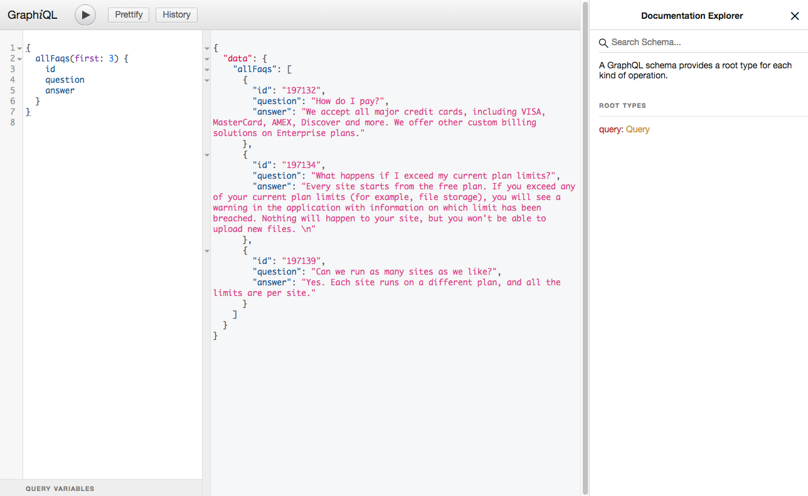

### Authenticating with GraphQL

To communicate with the GraphQL server, you'll need a read-only API token. You can find your API token in the *Admin area > API tokens* section of your administrative area:


### The GraphQL endpoint

DatoCMS offers a single GraphQL endpoint: 

```
https://site-api.datocms.com/graphql
```

The endpoint remains constant no matter what operation you perform, and it's read only — that is, it does not offer any *mutation operation*. You can use our [REST API](/api/) for that.

#### Preview endpoint

If you have the [Draft/Published system](/docs/introduction/versioning/#draftpublished-system) active on some of your models, you can use a different endpoint to access records at their latest version available: this can be useful on staging environments, or your local development machine:

```
https://site-api.datocms.com/graphql/preview
```

Both endpoints offer exactly the same queries, the only thing that will change will be the returned content.

### Communicating with GraphQL

In REST, HTTP verbs determine the operation performed. In GraphQL, you'll provide a JSON-encoded body even if you're performing a query operation, so the HTTP verb is always `POST`.


#### Curl example

```bash
$ curl 'https://site-api.datocms.com/graphql' \
    -H 'Authorization: YOUR-API-TOKEN' \
    -H 'Content-Type: application/json' \
    -H 'Accept: application/json' \
    --data-binary '{ "query": "query { allPosts { title } }" }'
```

#### Vanilla JS example

```js
const token = 'YOUR-API-TOKEN';

fetch(
  'https://site-api.datocms.com/graphql',
  {
    method: 'POST',
    headers: {
      'Content-Type': 'application/json',
      'Accept': 'application/json',
      'Authorization': `Bearer ${token}`,
    },
    body: JSON.stringify({
      query: '{ allPosts { title } }'
    }),
  }
)
.then(res => res.json())
.then((res) => {
  console.log(res.data)
})
.catch((error) => {
  console.log(error);
});
```

#### Apollo example

```js
import { ApolloClient } from 'apollo-client';
import { createHttpLink } from 'apollo-link-http';
import { setContext } from 'apollo-link-context';
import { InMemoryCache } from 'apollo-cache-inmemory';
import gql from 'graphql-tag';

const token = 'YOUR-API-TOKEN';

const httpLink = createHttpLink({
  uri: 'https://site-api.datocms.com/graphql',
});

const authLink = setContext((_, { headers }) => {
  return {
    headers: Object.assign(
      headers || {},
      {
        'Content-Type': 'application/json',
        'Accept': 'application/json',
        'Authorization': `Bearer ${token}`,
      }
    )
  }
});

const client = new ApolloClient({
  link: authLink.concat(httpLink),
  cache: new InMemoryCache(),
});

client.query({ query: gql`{ allPosts { title } }` })
.then((res) => {
  console.log(res.data);
})
.catch((error) => {
  console.log(error);
});
```

### Discovering the GraphQL API

The schema of each administrative is different, and depends on the models it contains. GraphQL is [introspective](http://graphql.org/learn/introspection/). This means you can query a GraphQL schema for details about itself. 

Query `__schema` to list all types defined in the schema and get details about each:

```graphql
query {
  __schema {
    types {
      name
      kind
      description
      fields {
        name
      }
    }
  }
}
```

A more visual approach to see what queries are available in your schema is to use our [GraphQL API Explorer](http://site-api.datocms.com/graphiql):


