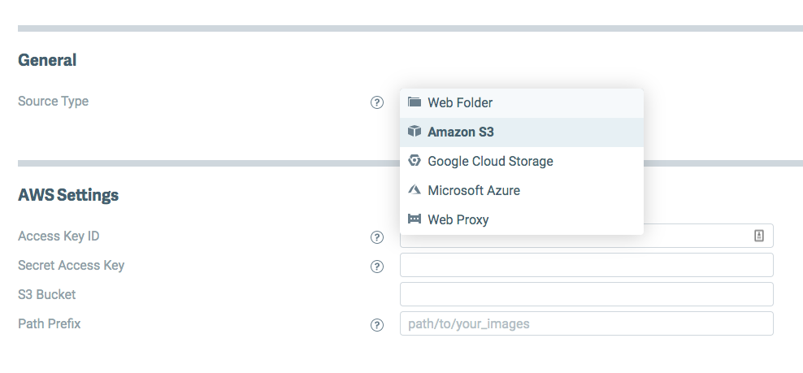
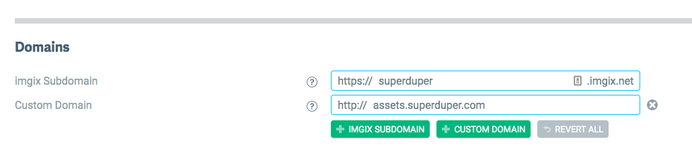

DatoCMS uses the domain `www.datocms-assets.com` to serve your project's asset files. On [higher plans](/pricing/), you can choose to use your own S3 account and domain. Here's how it works:

### Create an S3 bucket

Login to the [AWS console](https://console.aws.amazon.com/) and create a new S3 bucket.

Make sure to add the following CORS configuration to the bucket:

```xml
<?xml version="1.0" encoding="UTF-8"?>
<CORSConfiguration xmlns="http://s3.amazonaws.com/doc/2006-03-01/">
  <CORSRule>
    <AllowedOrigin>*</AllowedOrigin>
    <AllowedMethod>GET</AllowedMethod>
    <AllowedMethod>POST</AllowedMethod>
    <AllowedMethod>PUT</AllowedMethod>
    <AllowedHeader>*</AllowedHeader>
  </CORSRule>
</CORSConfiguration>
```

Create an IAM key with the following permissions:

```json
{
  "Statement": [
    {
      "Action": [
        "s3:ListAllMyBuckets"
      ],
      "Effect": "Allow",
      "Resource": "arn:aws:s3:::*"
    },
    {
      "Action": "s3:*",
      "Effect": "Allow",
      "Resource": [
        "arn:aws:s3:::your-bucket-name",
        "arn:aws:s3:::your-bucket-name/*"
      ]
    }
  ]
}
```

### Create an Imgix source

Go to [Imgix](https://www.imgix.com/) and create a new account. Create a new source, and link it to the S3 bucket you just created.



### Adding a custom domain

If you're not satisfied with the default Imgix subdomain (ie. https://your-source.imgix.net) you can add a custom domain to the Imgix source, then configure your domain DNS settings so that its CNAME record points to `your-source.imgix.net`:



#### Enable HTTPS for the Imgix source

DatoCMS requires HTTPS for custom domains. There are two different ways you can enable it. The first one is to request an HTTP certificate to Imgix. From the [Imgix documentation](https://docs.imgix.com/setup/creating-sources/advanced-settings):

> By default, you will only be able to use the custom subdomain with http. Using https requires an SSL certificate through our CDN partner and incurs additional fees—please [contact Imgix Support](mailto:support@imgix.com) to set this up.

Alternatively, to get HTTPS for free, you can use Cloudflare on top of Imgix. This is a cheaper alternative, but requires changing your original domain nameservers to the Cloudflare nameservers, which is something you might not want, and [might have some impacts in the way assets are returned](https://docs.imgix.com/best-practices/cdn-guidelines).

### Send request for custom uploads to DatoCMS support

Once everything is ready, send an email to [support@datocms.com](mailto:support@datocms.com) and request the change. These are the information we'll ask you for:

* Your S3 bucket name (`my-bucket-name`) and region (ie. `eu-west-1`)
* Your IAM key ID and secret
* The Imgix domain (ie. `your-source.imgix.net` or `assets.superduper.com`)

Together we'll schedule a maintenance window where we'll transfer every assets already uploaded to your Project to the new S3 bucket, and enable the custom domain.
