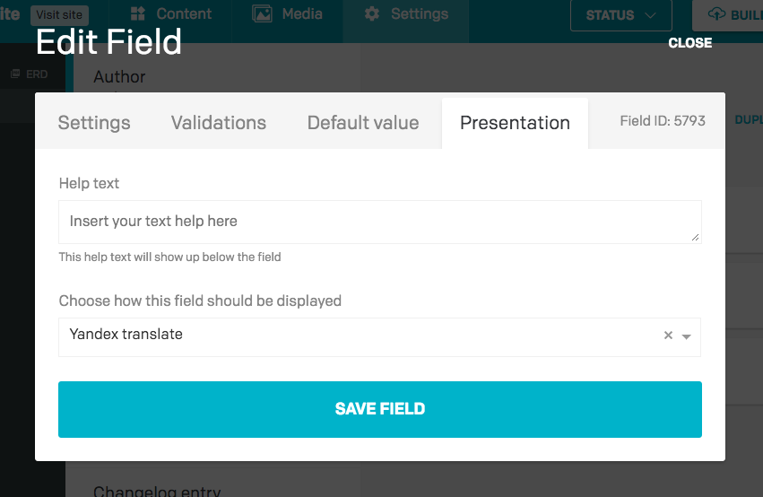

To get started:

1. Navigate to *Settings > UI Extensions* in your project administrative area;
1. Select *Create new extension* hovering the mouse on the plus button;
1. Enter a *Name* for the extension;
1. Enter the *Extension entry point URL*, that is the HTML page that will be embedded into the DatoCMS entry editor as an `<iframe>`;
1. Select the types of field where it will be possible to use the extension;
1. If needed, enter some [parameter definitions](/docs/ui-extensions/configuration-parameters/) and select whether the extension must be rendered in sidebar or not.

Click Save to create the extension.

### Assigning an extension to a field

Once an extension has been successfully installed, they can be assigned to one (or many) fields in one of your models. To do that:

1. Navigate to a Model and select a field;
1. Navigate to the *Settings > Presentation* tab of the field;
1. Select the desired UI Extension;
1. Navigate to a record of the model to see the selected UI Extension in action.

The image below shows the *Presentation* tab under the settings of a field:

To use the extension across several fields or content types, repeat the above steps again for each field.
